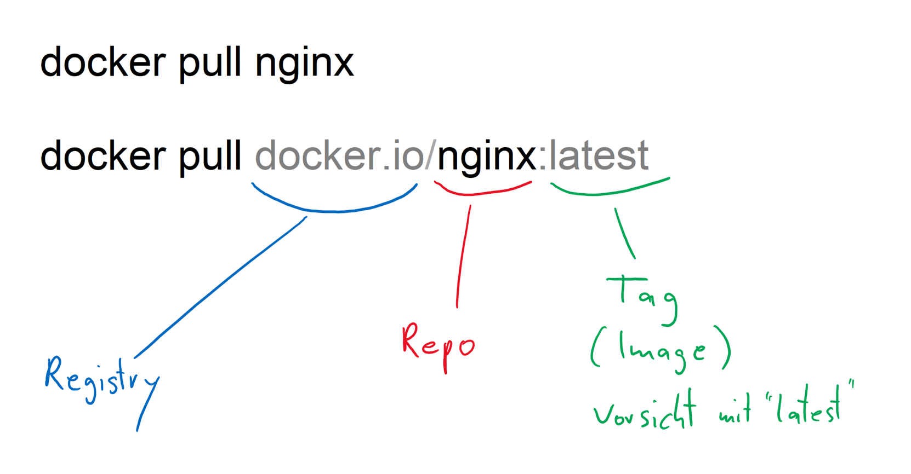

# Challenge Container Registry 

Open Bash (in CloudShell). Make sure you have the latest az cli version installed. **If not** in CloudShell log in to your Azure account.
<details>

```bash
az --version | grep ^azure-cli

az login
az account list --all -o table
```
</details>


Create a resource group.
<details>

```bash
rgName='acr-RG'
location='westeurope'
az group create --name $rgName --location $location
```
</details>

Create an Azure Container Registry (ACR). Choose a unique name.
<details>

```bash
acrName='foo123'
az acr check-name --name $acrName
az acr create --name $acrName --sku Basic --location $location --resource-group $rgName --admin-enabled true
az acr list -o table
loginServer=$(az acr show --name $acrName --query 'loginServer' -o tsv)
userName=$acrName
password=$(az acr credential show --name $acrName --query 'passwords[0].value' -o tsv)
```
</details>


If necesary change to your Docker host. Remember your `mynginx:red` image (Docker challenge)
<details>

```bash
docker image ls mynginx:red
```
</details>


Change the registry in your custom image by tagging.

<details>

```bash
# Registry /Repo :Image (=Tag)
# --------  ----  ------------
#           nginx
# docker.io/nginx
# docker.io/nginx:latest
# docker.io/nginx:1.16.0

docker tag mynginx:red $loginServer/mynginx:red
docker image ls
```
</details>


Log in to ACR and push image to ACR.
<details>

```bash
az acr login --name $acrName --username $userName --password $password
docker push $loginServer/mynginx:red
az acr repository list --name $acrName
az acr repository show --name $acrName --image mynginx:red
```
</details>


Untag image.
<details>

```bash
docker rmi $loginServer/mynginx:red
```
</details>


For testing pull image from ACR
<details>

```bash
docker run --rm --name redAcr -d -p 80:80 $loginServer/mynginx:red
docker ps

```
</details>


Build your own image "green" as ACR task

<details>

```bash
cd Docker
sed -i '' -e 's/red/green/g' index.html

az acr build --registry $acrName --image mynginx:green .
az acr repository show-tags --name $acrName --repository mynginx --detail -o table
az acr repository show --name $acrName --image mynginx:green

```
</details>


Test new image
<details>

```bash
docker run --rm --name greenAcr -d -p 81:80 $loginServer/mynginx:green 
```
</details>