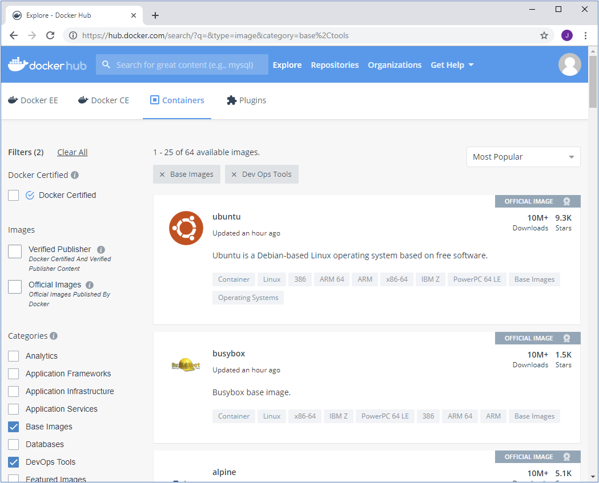
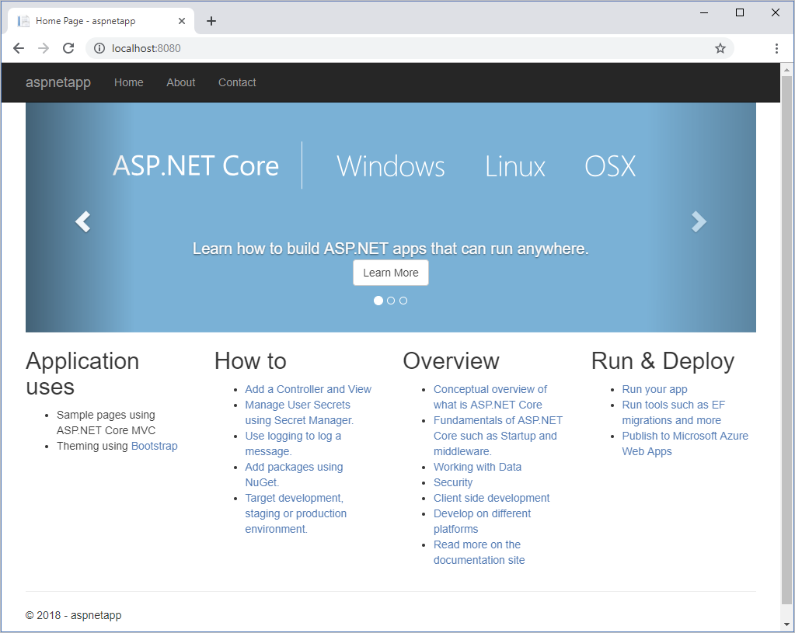

# Docker Basics #

## Here's what you'll learn: ##
- Container basics
    - Get a feeling for work with containers and understand their purpose
    - Learn about the Docker Hub
    - Understand what a Dockerfile is
    - How to create a container image
    - How to run a container image locally
    - Get a sense for container networking and ports
    - How to create new versions of images
    - Learn about tagging
- Deployment
    - How to provide a container image in a registry 
    - How to use a container registry
    - How to run a container on-prem

## Deploying and retrieving Docker Container ##

Docker is a technology that enables you to deploy applications and services quickly and easily. A Docker app runs using a Docker image. A Docker image is a prepackaged environment containing the application code and the environment in which the code executes.
In the corporate scenario described earlier, you want to investigate the feasibility of packaging and running an app with Docker. You decide to build and deploy a Docker image running a test web app.
In this unit, you'll learn about the key concepts and processes involved in running a containerized app stored in a Docker image.

## Overview of Docker ##

Docker is a tool for running containerized apps. A containerized app includes the app and the filesystem that makes up the environment in which it runs.For example, a containerized app could include a database and other associated software and configuration information needed to run the app.
A containerized app typically has a much smaller footprint than a virtual machine configured to run the same app. This is because a virtual machine has to supply the entire operating system and associated supporting environment. A Docker container doesn't have this overhead because Docker uses the operating system kernel of the host computer to power the container. Downloading and starting a Docker image is typically much faster and more space-efficient than downloading and running a virtual machine that provides similar functionality.
You create a containerized app by building an image that contains a set of files and a block of configuration used by Docker. You run the app by asking Docker to start a container based on the image. When the container starts, Docker uses the image configuration to determine what application to run inside the container. Docker provides the operating system resources and the necessary security to ensure that containers running concurrently remain relatively isolated.

* Important
Docker does not provide the level of isolation available with virtual machines. A virtual machine implements isolation at the hardware level. With Docker, containers share underlying operating system resources and libraries, although Docker ensures that one container cannot access the resources of another unless the containers are configured to do so.

You can run Docker on your desktop or laptop if you're developing and testing locally. For production systems, Docker is available for server environments, including many variants of Linux and Microsoft Windows Server 2016. Many vendors also support Docker in the cloud. For example, you can store Docker images in Azure Container Registry and run containers with Azure Container Instances.
In this unit, you'll use Docker locally to build and run an image, then upload it to Azure Container Registry and run it in an Azure Container Instance. This version of Docker is suitable for local development and testing of Docker images.

## Linux and Windows Docker images ##

Docker was originally developed for Linux and has expanded to support Windows. Individual Docker images are either Windows-based or Linux-based, but can't be both at the same time. The operating system of the image determines what kind of operating system environment is used inside the container.
Authors of Docker images who wish to offer similar functionality in both Linux-based and Windows-based images can build those images separately. For example, Microsoft offers Windows and Linux Docker images containing an ASP.NET Core environment that can be used as the basis for containerized ASP.NET Core applications.
Linux computers with Docker installed can only run Linux containers. Windows computers with Docker installed can run both kinds of containers. Windows accomplishes this by using a virtual machine to run a Linux system, and uses the virtual Linux system to run Linux containers.
In this module, you will build and run a Linux-based image.

## Docker registries and Docker Hub  ##

Docker images are stored and made available in registries. A registry is a web service to which Docker can connect to upload and download container images. The most well-known registry is Docker Hub, which is a public registry. Many individuals and organizations publish images to Docker Hub, and you can download and run these images using Docker running on your desktop, on a server, or in the cloud. You can create a Docker Hub account and upload your own images there for free.

A registry is organized as a series of repositories. Each repository contains multiple Docker images that share a common name (and generally the same purpose and functionality) but have different versions. Each version is identified by a tag. This mechanism enables you to publish and retain multiple versions of images for compatibility reasons. When you download and run an image, you must specify the registry, repository, and version tag for the image. Tags are simply text labels, and you can use your own version numbering system (v1.0, v1.1, v1.2, v2.0, and so on).

* Note
A single image can have multiple tags assigned to it. By convention, the most recent version of an image is assigned the tag latest in addition to a tag that describes its version number. When you release a new version of an image, you can reassign the latest tag to reference the new image.

A repository is also the unit of privacy for an image. If you don't wish to share an image, you can make the repository private. You can grant access to other users with whom you want to share the image.

## Browse Docker Hub and pull an image ##

Often you'll find that there's an image in Docker Hub that closely matches the type of app you want to containerize. You can download such an image and extend it with your own application code.
Docker Hub contains many thousands of images. While it's possible to search and browse a registry using Docker from the command line, Docker Hub offers a website that enables you to search, filter, and select images by type and publisher. The figure below shows an example of the search page.



You retrieve an image by using the docker pull command with the image name. If you specify only the repository name, Docker will download the image tagged latest from that repository on Docker Hub, but you can modify the command to pull different tags and from different repositories. This example fetches the image with the tag aspnetappfrom the microsoft/dotnet-samples repository (this image contains a simple ASP.NET web app).

* Note
The examples in this unit are intended to show the syntax of the various Docker commands. You don't need to run these commands while reading this unit. The exercises that follow this unit will guide you through working with Docker directly.

bashCopy
```
docker pull microsoft/dotnet-samples:aspnetapp
```

When you fetch an image, Docker stores it locally and makes it available for running containers. You can view the images in your local registry with the docker image list command.

bashCopy
```
docker image list
The output looks like the example below.
consoleCopy
REPOSITORY                 TAG                 IMAGE ID            CREATED             SIZE
microsoft/dotnet-samples   aspnetapp           575d85b4a69b        5 weeks ago         263MB
```

You use the image name ID to reference the image in many other Docker commands.
Run a Docker container
Use the docker run command to start a container. Specify the image to run with its name or ID. If you haven't docker pulled the image already, Docker will do it for you.

bashCopy
```
docker run microsoft/dotnet-samples:aspnetapp
```

In this example, the command will respond with the following message:

consoleCopy
```
warn: Microsoft.AspNetCore.DataProtection.KeyManagement.XmlKeyManager[35]
      No XML encryptor configured. Key {d8e1e1ea-126a-4383-add9-d9ab0b56520d} may be persisted to storage in unencrypted form.
Hosting environment: Production
Content root path: /app
Now listening on: http://[::]:80
Application started. Press Ctrl+C to shut down.
```

This image contains a web app, so it's now listening for requests to arrive on HTTP port 80. However, if you open a web browser and navigate to ```http://localhost:80```, you won't see the app.



By default, Docker doesn't allow inbound network requests to reach your container. To enable network requests, you need to tell Docker to assign a specific port number from your computer to a specific port number in the container by adding the ```-p``` option to ```docker run```.

Additionally, the web app in this image isn't meant to be used interactively from the command line. When we start it, we want Docker to start it in the background and just let it run. This can be achieved with the ```-d``` flag.
You can press Ctrl-C to stop the image and then restart it as shown by the following example.

bashCopy
```
docker run -p 8080:80 -d microsoft/dotnet-samples:aspnetapp
```

The command maps port 80 in the container to port 8080 on your computer. If you visit the page ```http://localhost:8080``` in a browser, you'll see the sample web app.
 
## Containers and files ##

If a running container makes changes to the files in its image, those changes only exist in the container where the changes are made. Unless you take specific steps to preserve the state of a container, these changes will be lost when the container is removed. Similarly, multiple containers based on the same image that run simultaneously do not share the files in the image — each container has its own independent copy. Any data written by one container to its filesystem are not visible to the other.

It's possible to add writable volumes to a container. A volume represents a filesystem that can be mounted by the container, and is made available to the application running in the container. The data in a volume does persist when the container stops, and multiple containers can share the same volume. The details for creating and using volumes are outside the scope of this module.
In most cases, for applications deployed with Docker, it is a best practice to avoid the need to make changes to the image filesystem, or only use it for temporary files that can afford to be lost.

## Manage Docker containers ##

You can view active containers with the docker ps command.

bashCopy
```
docker ps
```

The output includes the status of the container (Up if it is running, Exited if it has terminated, among other values), the command line flags specified when the image was started, and other information. Docker lets you run multiple containers from the same image simultaneously, so each container is assigned a unique ID as well as a unique human-readable name. Most Docker commands used to manage individual containers can use either the ID or the name to refer to a specific container.

In the output below, you can see two containers. The PORTS field shows that the container with ID lucid-jang is the image running with port 80 on the Docker host mapped to port 8080 on your computer. The youthful_heisenberginstance is the container for the previous run of the image. The COMMAND* field shows the command that the container ran to start the application in the image. In this case, for both containers, it is dotnet aspnetapp.dll. Note that the image ID for the containers is also the same because both containers are executing the same image.

consoleCopy
```
CONTAINER ID        IMAGE               COMMAND                  CREATED             STATUS              PORTS                  NAMES
36c63b465b5f        575d85b4a69b        "dotnet aspnetapp.dll"   5 minutes ago       Up 5 minutes        0.0.0.0:8080->80/tcp   lucid_jang
c13165988cfe        575d85b4a69b        "dotnet aspnetapp.dll"   17 minutes ago      Up 17 minutes                              youthful_heisenberg
```

* Note
docker ps is a shortcut for docker container ls. The names of these commands are based on the Linux utilities ps and ls, which list running processes and files, respectively.

You can stop an active container with the docker stop command and specify the container ID.

bashCopy
```
docker stop lucid_jang
```

If you run docker ps again, you'll see that the lucid_jang container is no longer present in the output. The container still exists, but is no longer hosting a running process. You can include stopped containers in the output of docker ps by including the ```-a``` flag:

consoleCopy
```
CONTAINER ID        IMAGE               COMMAND                  CREATED             STATUS                            PORTS               NAMES
36c63b465b5f        575d85b4a69b        "dotnet aspnetapp.dll"   19 minutes ago      Exited (137) About a minute ago                       lucid_jang
c13165988cfe        575d85b4a69b        "dotnet aspnetapp.dll"   30 minutes ago      Up 30 minutes                                         youthful_heisenberg
```

You can restart a stopped container with the docker start command. The main process of the container will be started anew.

bashCopy
```
docker start lucid_jang
```

Typically, once a container is stopped, it should also be removed. Removing a container cleans up any resources it leaves behind. Once you remove a container, any changes made within its image filesystem are permanently lost.

bashCopy
```
docker rm lucid_jang
```

You can't remove a container that is running, but you can force a container to be stopped and removed with the ```-f``` flag to the docker rm command. This is a quick way to stop and remove a container, but should only be used if the app inside the container does not need to perform any kind of graceful shutdown.

bashCopy
```
docker container rm -f lucid_jang
Remove Docker images
```

You can remove an image from the local computer with the docker image rm command. Specify the image ID of the image to remove. This example removes the image for the sample web app:

bashCopy
```
docker image rm microsoft/dotnet-samples:aspnetapp
```

Containers running the image must be terminated before the image can be removed. If the image is still in use by a container, you'll get an error message like the one shown below. In this example, the error occurs because the youthful_hesienburg container is still using the image.

consoleCopy
```
Error response from daemon: conflict: unable to delete 575d85b4a69b (cannot be forced) - image is being used by running container c13165988cfe
```
## Customize a Docker image to run your own web app ##

Docker Hub is an excellent source of images to get you started building your own containerized apps. You can download an image that provides the basic functionality you require, and layer your own application on top of it to create a new custom image. You can automate the steps for doing this process by writing a Dockerfile.

In the scenario of an online clothing store, the company has decided that Docker is the way forward. The next step is to determine the best way to containerize your web applications. The company plans to build many of the apps using ASP.NET Core, and you've noticed that Docker Hub contains a base image that includes this framework as well as Nginx webserver for the webcomponents. As a proof of concept, you want to take this base images and add the code for one of the web apps to create a new custom image. You also want this process to be easily repeatable, so it can be automated whenever a new version of the web app is released.
In this unit, you'll learn how to create a custom Docker image, and how you can automate the process by writing a Dockerfile.

## Create a custom image with a Dockerfile ##

To create a Docker image containing your application, you'll typically begin by identifying a base image to which you add additional files and configuration. The process of identifying a suitable base image usually starts with a search on Docker Hub for a ready-made image that already contains an application framework and all the utilities and tools of a Linux distribution like Ubuntu or Alpine.

For example, if you have an ASP.NET Core application that you want to package into a container, Microsoft publishes an image called mcr.microsoft.com/dotnet/core/aspnet that already contains the ASP.NET Core runtime.
So you will only have to find an official image for the Nginx webserver on the Docker Hub.

An image can be customized by starting a container with the base image and making changes to it. Changes usually involve activities like copying files into the container from the local filesystem, and running various tools and utilities to compile code. When finished, you would use the docker commit command to save the changes to a new image.

Manually completing the above process is time-consuming and error-prone. It could be scripted with a script language like Bash, but Docker provides a more effective way of automating image creation via a Dockerfile.

A Dockerfile is a plain text file containing all the commands needed to build an image. Dockerfiles are written in a minimal scripting language designed for building and configuring images. documents the operations required to build an image starting with a base image.
The following example shows a Dockerfile that builds a .NET Core 2.2 application and packages it into a new image.

DockerfileCopy
```
FROM mcr.microsoft.com/dotnet/core/sdk:2.2
WORKDIR /app
COPY myapp_code .
RUN dotnet build -c Release -o /rel
EXPOSE 80
WORKDIR /rel
ENTRYPOINT ["dotnet", "myapp.dll"]
```

In this file:

- The FROM statement downloads the specified image and creates a new container based on this image.
- The WORKDIR command sets the current working directory in the container, used by the following commands.
- The COPY command copies files from the host computer to the container. The first argument (myapp_code) is a file or folder on the host computer. The second argument (*.*) specifies the name of the file or folder to act as the destination in the container. In this case, the destination is the current working directory (/app).
- The RUN command executes a command in the container. Arguments to the RUN command are command-line commands.
- The EXPOSE command creates configuration in the new image that specifies which ports are intended to be opened when the container is run. If the container is running a web app, it's common to EXPOSE port 80.
- The ENTRYPOINT command specifies the operation the container should run when it starts. In this example, it runs the newly-built app. You specify the command to be run and each of its arguments as a string array.

* Note
The ENTRYPOINT is also the only thing worth living for the container by removing it you also force the container to go out of live. Even it is like that, there is no testing for health or vital conditions in conatainers. So you will have to check and monitor the container from the hosting system you, yourself.

By convention, applications meant to be packaged as Docker images typically have a Dockerfile located in the root of their source code, and it's almost always named Dockerfile. This is an convention we will also stick to.

The docker ```build``` command creates a new image by running a Dockerfile. The ```-f``` flag indicates the name of the Dockerfile to use. The ```-t``` flag specifies the name of the image to be created, in this example, myapp:v1. The final parameter, ```.```, provides the build context for the source files for the COPY command: the set of files on the host computer needed during the build process.

bashCopy
```
docker build -t myapp:v1 .
```

Behind the scenes, the docker build command creates and runs a container, runs commands in it, then commits the changes to a new image.

We can do the whole build process in one stage this time. But you can also do mulit-staged build process. Which actually means you change the base images and frameworks used for compiling, configuring and operating accordingly. 
The best thing using Dockerfiles is, it provides you an easy way to handle updates on frameworks and base images.