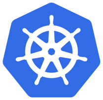

# Kubernetes Architecture #

Kubernetes is a platform for deploying, scaling and managing container based applications in a secure, resilient manner.
It enables you to abstract away the underlying infrastructure to dynamically scale and deploy your containerized applications. 

Through specifying your "desired state" (within manifests), the K8S control plane works behind the scenes to ensure the current state of your application meets the desired state.  It does so even in the event of your application crashing or if there is a hardware failure.


Diagram by [Lucas Käldström](https://docs.google.com/presentation/d/1Gp-2blk5WExI_QR59EUZdwfO2BWLJqa626mK2ej-huo/edit#slide=id.g1e639c415b_0_56)


## Here's what you'll learn: ##
- Kubernetes basics
    - Why Kubernetes and Orchestration in General
    - Hello world: Minikube basics, talking through Minikube,
    - Cluster and basic commands, 
    - Nodes, 
    - Deployments, what it is and deploying an app
    - Pods and Nodes, explain concepts and troubleshooting

- Resources
    - Kubernetes.io One of the best resources to learn about Kubernetes is at this official Kubernetes site by Google.
    - Kubernetes overview An overview on Kubernetes, all its parts and how it works
    - Free Azure Account If you want to try out AKS, Azure Kubernetes Service, you will need a free Azure account
    - Kubernetes in the Cloud Do you feel you know everything about Kubernetes already and just want to learn how to use a managed service? Then this link is for you
    - Documentation on AKS, Azure Kubernetes Service Azure Kubernetes Service, a managed Kubernetes
    - Best practices on AKS You already know AKS and want to learn how to use it better?
- Deployment
    - How to a simple deploy example
    - How to 
    - How to 

## Kubernetes - Why Orchestration ##

Kubernetes is about orchestrating containerized apps. Docker is great for your first few containers. As soon as you need to run on multiple machines and need to scale/up down and distribute the load and so on, you need an orchestrator - you need Kubernetes

Well, it all started with containers. Containers gave us the ability to create repeatable environments so dev, staging, and prod all looked and functioned the same way. We got predictability and they were also light-weight as they drew resources from the host operating system. Such a great breakthrough for Developers and Ops but the Container API is really only good for managing a few containers at a time. Larger systems might consist of 100s or 1000+ containers and needs to be managed as well so we can do things like scheduling, load balancing, distribution and more.

At this point, we need orchestration the ability for a system to handle all these container instances. This is where Kubernetes comes in.

## Kubernetes ##

So what do we know about Kubernetes?
It's an open-source system for automating deployment, scaling, and management of containerized applications
Let'start with the name. It's Greek for Helmsman, the person who steers the ship. Which is why the logo looks like this, a steering wheel on a boat:



It's Also called K8s so K ubernete s, 8 characters in the middle are removed. Now you can impress your friends that you know why it's referred to as K8.
Here is some more Jeopardy knowledge on its origin. Kubernetes was born out of systems called Borg and Omega. It was donated to CNCF, Cloud Native Computing Foundation in 2014. It's written in Go/Golang.
If we see past all this trivia knowledge, it was built by Google as a response to their own experience handling a ton of containers. It's also Open Source and battle-tested to handle really large systems.
Well even if you have something like 10-100 containers, it's for you.

## Getting started ##

First of all we will need a Kubernestes Cluster with two or three Nodes and... Yes, we need to know some of the Basics of Kubernetes to understand what a Node exactly is. There is an easy all in one soluiton to get started called MiniKube.
To install Minikube lets go to this 
It's just a few short steps that means we install
    - a Hypervisor
    - Kubectl (Kube control tool)
    - Minikube

### Run ###

Get that thing up and running by typing:

bashCode
```
minikube start
```
It should look something like this:

bashCode
```
$ minikube version
minikube version: v0.34.1
$ minikube start
o   minikube v0.34.1 on linux (amd64)
>   Configuring local host environment ...
>   Creating none VM (CPUs=2, Memory=2048MB, Disk=20000MB) ...
-   "minikube" IP address is 172.17.0.15
-   Configuring Docker as the container runtime ...
-   Preparing Kubernetes environment ...
@   Downloading kubeadm v1.13.3
@   Downloading kubelet v1.13.3
-   Pulling images required by Kubernetes v1.13.3 ...
-   Launching Kubernetes v1.13.3 using kubeadm ...
-   Configuring cluster permissions ...
-   Verifying component health .....
+   kubectl is now configured to use "minikube"
=   Done! Thank you for using minikube!
$
```

You can also ensure that kubectl have been correctly installed and running:

```
kubectl version
```

Should give you something like this in response:

```
$ kubectl version
Client Version: version.Info{Major:"1", Minor:"13", GitVersion:"v1.13.3", GitCommit:"721bfa751924da8d1680787490c54b9179b1fed0", GitTreeState:"clean", BuildDate:"2019-02-01T20:08:12Z", GoVersion:"go1.11.5", Compiler:"gc", Platform:"linux/amd64"}
Server Version: version.Info{Major:"1", Minor:"13", GitVersion:"v1.13.3", GitCommit:"721bfa751924da8d1680787490c54b9179b1fed0", GitTreeState:"clean", BuildDate:"2019-02-01T20:00:57Z", GoVersion:"go1.11.5", Compiler:"gc", Platform:"linux/amd64"}
$
```

Ok, now we are ready to learn Kubernetes.

## Learning kubectl and basic concepts ##

In learning Kubernetes lets do so by learning more about kubectl a command line program that lets us interact with our Cluster and lets us deploy and manage applications on said Cluster.
The word Cluster just means a group of similar things but in the context of Kubernetes, it means a Master and multiple worker machines called Nodes. Nodes were historically called Minions 


, but not so anymore.
The master decides what will run on the Nodes, which includes things like scheduled workloads or containerized apps. Which brings us to our next command:

```
kubectl get nodes
```
What this tells us what Nodes we have available to do work.

Next up lets check that everything is up and running with the command:

```
kubectl get deployments
```


Boosting your kubectl productivity by [Daniel Weibel](https://learnk8s.io/blog/kubectl-productivity/)


### Pods ###


    - Pods are the basic unit for running Containers inside of Kubernetes
    - Pods can have one or more containers inside
    - A Pod provides a way to set enviroment variables, mount storage, and feed other Information into a container

In Kubernetes, Pods are responsible for running your containers. Every Pod holds at least one container, and controls the execution of that container. When the containers exit, the Pod dies too.

### ReplicaSets ###

    - ReplicaSets are considered a "low-level" type in Kubernetes
    - Often, Kubernetes users opt for higher level abstractions like Deployments and DaemonSets

A ReplicaSet ensures that a set of identically configured Pods are running at the desired replica count. If a Pod
drops off, the ReplicaSet brings a new one online as a replacement.

### Secrets ###

    - Secrets are Base64 encoded "at rest" but the data is automatically decoded when attached to a Pod
    - Secrets can be attached as files environment variables
    - Use add-on encryption providers for locking your data

Secrets are used to store non-public information, such as tokens, certificates, or passwords. Secrets can be stored securly in the cluster.

### Deployments ###

    - Deployments support rolling updates and rollbacks
    - Rollouts can even be paused

A Deployment is a higher-order abstraction that controls deploying and maintaining a set of Pods. Behind
the scenes, it uses a ReplicaSet to keep the Pods running, but it offers sophisticated logic for deploying,
updating, and scaling a set of Pods within a cluster.

### DaemonSets ###

    - DaemonSets have many uses - one frequent pattern is to use a DaeminSet to install or configure software on each host node

DaemonSets provide a way to ensure that a copy of a Pod is running on every node in the cluster. As a cluster grows and shrinks, the DaemonSet spreads these specially labeled Pods across all of the nodes.

### Ingresses ###

    - Route traffic to and from the cluster
    - Provide a single SSL endpoint for multiple applications
    - Many different implementations of an ingress allow you to customize for your platform

Ingresses provide a way to declare that traffic ought to be channeled from the outside of the cluster into destination points within the cluster. One single external Ingress point can accept traffic destined to many different internal services.

### CronJobs ###

    - Use common Cron syntax to schedule tasks
    - CornJobs are part of the batch API for creating short lived non-server tools

CronJobs provide a method for scheduling the execution of Pods. They are excellent for running periodic tasks like backups, reports, and automated tests.

### CustomResourceDefinitions - CDR's ###

    - A CDR defines a new resource type and tells Kubernetes about it
    - Once a new resource type is added, new instances of that resource may be created
    - Handling CDR changes is up to you. A common pattern is to create a custom controller that watches for new CDR instances and reponds accordingly

CustomResourceDefinitions, or CRDs, provide an extension mechanism that cluster operators and developers can use to create their own resource types.
